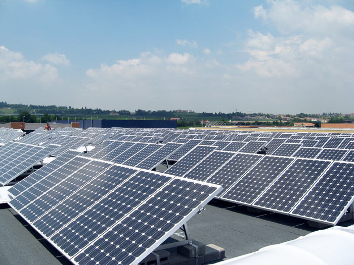

```{r setup, echo=FALSE, results='hide', message=FALSE, warning=FALSE}
# Če želimo nastaviti pisave v PDF-ju, odkomentiramo
# in sledimo navodilom v programu.
#source("fontconfig.r", encoding = "UTF-8")

# Uvoz vseh potrebnih knjižnic
source("lib/libraries.r", encoding = "UTF-8")
```

  

# Izbira teme

Raziskoval bom proizvodnjo in porabo električne energije v Sloveniji in Evropi. Raziskoval bom, kako vpliva vse večje vključevanje "zelenih" porabnikov energije - električnih vozil in toplotnih črpalk na proizvodnjo energije. Opazoval bom trend trajnostne energije. Zanimajo me države, ki najbolj zmanjšujejo odvisnost od fosilnih virov energije ter zagotavljajo možnosti za zmanjševanje toplogrednih plinov.

Razlogi, zakaj je energija iz obnovljivih virov boljša:

1. vse oblike energije so drage, ampak s časom postajajo obnovljivi viri cenejši, vsa ostala fosilna goriva pa postajajo dražja,

2. ko je sistem enkrat vgrajen, je energija vedno zastonj.

3. medtem ko so fosilna goriva draga, sonce in veter zagotavljata brezplačno energijo, ki je dejansko neomejena. Tehnologija fosilnih goriv je več ali manj zrela, tehnologija obnovljivih virov pa se vsak dan bolj razvija in dopolnjuje, s tem pa zmanjšuje stroške pridobivanja.

4. svet se bo vedno bolj nagibal k tej obliki energije in čim višji bo ta razvoj, tem nižji bodo stroški elementov.

### Podatkovni viri 

1. http://www.energetika-portal.si/statistika/ (.CSV)
2. http://pxweb.stat.si/pxweb/Database/Okolje/Okolje.asp#18 (.CSV)
3. https://www.destatis.de/EN/FactsFigures/EconomicSectors/Energy/Production/Tables/TablesElectricity.html (.HTML)
4. http://ec.europa.eu/eurostat/web/energy/data/main-tables (.CSV)
5. http://www.eafo.eu/vehicle-statistics/m1 (.JSON)
6. https://en.wikipedia.org/wiki/Area_and_population_of_European_countries (.HTML)


***

# Obdelava, uvoz in čiščenje podatkov

```{r uvoz, echo=FALSE, message=FALSE, warning=FALSE}
source("uvoz/uvoz.r", encoding = "UTF-8")
```

Uvozili smo podatke iz različnih virov (Eurostat (.CSV), drugi viri (.HTML in .JSON)).

1. `tabela1` - podatki o proizvodnji električne energije v EU po proizvodnih delih
  - `leto` - spremenljivka: leto,
  - `drzava` - spremenljivka: ime države,
  - `tip` - spremenljivka: proizvodni del - tip elektrarne,
  - `vrednost` - meritev: proizvedena električna energija (v terajoulih).

2. `tabela2` - podatki o porabi električne energije v EU po panogi
  - `leto` - spremenljivka: leto,
  - `drzava` - spremenljivka: ime države,
  - `tip` - spremenljivka: panoga,
  - `vrednost` - meritev: poraba električna energija (v terajoulih).
  
3. `tabela3` - podatki o  proizvodnji energije iz obnovljivih virov
  - `leto` - spremenljivka: leto,
  - `drzava` - spremenljivka: ime države,
  - `produkt` - spremenljivka: vir proizvodnje energije,
  - `vrednost` - meritev: proizvedena energija (v terajoulih).
  
4. `tabela4` - podatki o  prodaji električnih vozil v Evropi
  - `model` - spremenljivka: znamka in model avtomobila,
  - `leto` - spremenljivka: leto prodaje,
  - `vrednost` - meritev: število prodanih avtomobilov.
  
5. `tabela5` - podatki o  prodaji električnih vozil - hibridov v Evropi
  - `model` - spremenljivka: znamka in model avtomobila,
  - `leto` - spremenljivka: leto prodaje,
  - `vrednost` - meritev: število prodanih avtomobilov.
  
6. `tabela6` - podatki o  deležu električne energije iz obnovljivih virov
  - `leto` - spremenljivka: leto,
  - `drzava` - spremenljivka: ime države,
  - `vrednost` - meritev: delež električne energije iz obnovljivih virov.
  
7. `tabela7` - podatki o  porabi električne energije za toplotne črpalke
  - `leto` - spremenljivka: leto,
  - `drzava` - spremenljivka: ime države,
  - `vrednost` - meritev: poraba električne energije za toplotne črpalke.
  
8. `tabela8` - podatki o  površini držav in številu prebivalcev
  - `država` - spremenljivka: ime države,
  - `površina` - meritev: površina države v km^2,
  - `populacija` - meritev: število prebivalcev.

***

# Analiza in vizualizacija podatkov

```{r vizualizacija, echo=FALSE, message=FALSE, warning=FALSE}
source("vizualizacija/grafi.R", encoding = "UTF-8")
source("vizualizacija/zemljevid.R", encoding = "UTF-8")
```

Prikaz držav, ki proizvedejo največ (A) in najmanj (B) energije na prebivalca v Evropi skozi časovno obdobje 1990 – 2015. Opazim, da v zadnjih letih izstopa Islandija, ki ima po letu 2007 že 0.3 Terajoule proizvedene energije na prebivalca. Pričakovano so skoraj vse države iz severnega dela Evrope. Luxembourg spada v to kategorijo zato, ker ima samo okoli 30 tisoč prebivalcev. Pri državah, ki proizvedejo najmanj energije na prebivalca spada tudi Litva, ki uvozi 70% energije, večino iz Švedske. Cena elektrike je v Litvi ena najvišjih v Evropi, saj večino elektične energije uvozijo iz drugih držav.
Opazim, da je v letih 1995 - 2000 velik skok pri proizvodnji energije na Nizozemskem. V tem času so zgradili veliko vetrnih elektrarn.
Razlog, zakaj Moldavija proizvede najmanj energije glede na prebivalca je ta, da ima zelo malo virov fosilnih goriv.

```{r graf_skupaj1, echo=FALSE, message=FALSE, warning=FALSE}
graf_skupaj1
```

Prikaz prodaje električnih avtomobilov in hibridov v Evropi. Dokaj nizka prodaja električnih avtomobilov je posledica visoke cene le teh, saj so se električni avtomobili prebili na trg šele v 21. stoletju. Opazimo, da se poraba električne energije v transportu povečuje z večjo prodajo električnih avtomobilov. Trenutno je na trgu okrog 25 modelov avtomobilov, ki se jih da praktično uporabljati. Največ se jih proda na Japonskem 28%, sledi ZDA z 26%. Kitajska 16%, Francija 11% in Norveška 7%. Najbolj se prodaja model Nissan Leaf z 92.000 prodanimi.

```{r graf_skupaj2, echo=FALSE, message=FALSE, warning=FALSE}
graf_skupaj2
```

Poraba električne energije za toplotne črpalke. Tukaj je zanimivo, da sem našel statistične podatke samo za 7 evropskih držav. Najbolj izstopa Švedska, sledita pa ji Norveška in Finska. 

```{r graf5, echo=FALSE, message=FALSE, warning=FALSE}
graf5
```

Delež energije iz obnovljivih virov (pod obnovljive vire se šteje: biomasa, geotermalna, sončna, vetrna in vodna energija). Izstopajo severne države: Islandija, Norveška, Švedska in Finska. Izstopa tudi Albanija. Medtem ko EU kot celota deluje v skladu s svojimi cilji za leto 2020 (črna črta predstavlja cilj 20%), si morajo nekatere države dodatno prizadevati za izpolnjevanje svojih obveznosti - do časa izpolniti zadane cilje.
Obnovljiva energija v EU se je v zadnjih letih močno povečala. Konkretneje se je delež energije iz obnovljivih virov v bruto končni porabi energije v zadnjih letih skoraj podvojil, in sicer s približno 8,5% v letu 2004 do 17,0% v letu 2016

```{r graf8, echo=FALSE, message=FALSE, warning=FALSE}
graf8
```

Zemljevid prikazuje države po proizvedeni električni energiji na prebivalca. Iz zemljevida je vidno, da največ energije proizvedejo severne države, najmanj pa vzhodne države. Presenetljivo je, da je Nemčija nekje v povprečju celotne Evrope.

```{r zemljevid1, echo=FALSE, message=FALSE, warning=FALSE}
zemljevid1
```


```{r analiza, echo=FALSE, message=FALSE, warning=FALSE}
source("analiza/analiza.r", encoding = "UTF-8")
```

Spodnji graf prikazuje napoved prodaje električnih in hibridnih avtomobilov v letih 2017, 2018 in 2019. Po napovedih bo v prihodnjih letih še večja prodaja hibridnih in električnih avtomobilov. Po napovedi bo leta 2019 prodanih 185250 hibridnih in 150000 električnih avtomobilov.

```{r model4, echo=FALSE, message=FALSE, warning=FALSE}
model4
```

Graf prikazuje porabo električne energije v transportu in napoved porabe v letih 2016, 2017 in 2018. Opazim, da se poraba električne energije v transportu povečuje z prodajo električnih in hibridnih avtomobilov. 
Prometni sektor je porabil le 2,3% celotne porabe električne energije v Evropi

```{r model1, echo=FALSE, message=FALSE, warning=FALSE}
model1
```

#Aplikacija
```{r shiny, echo = FALSE,message=FALSE, warning=FALSE}
shinyAppDir("shiny", options=list(width="100%", height=1000))
```
